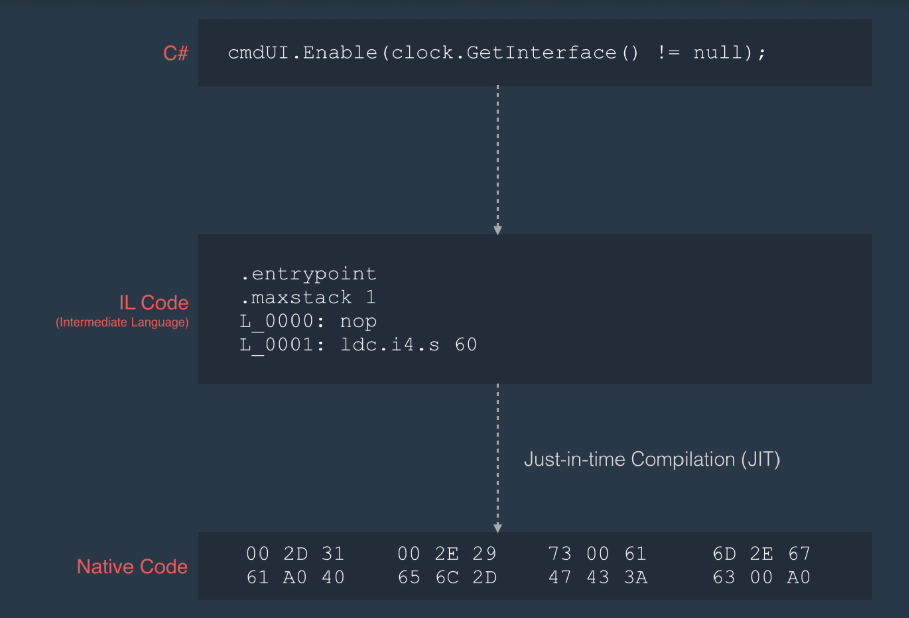
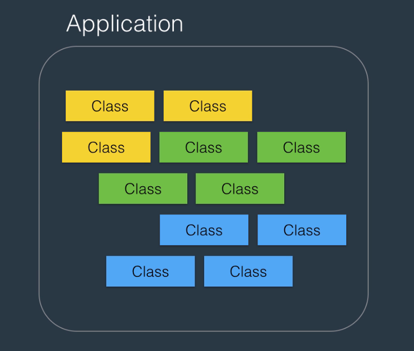
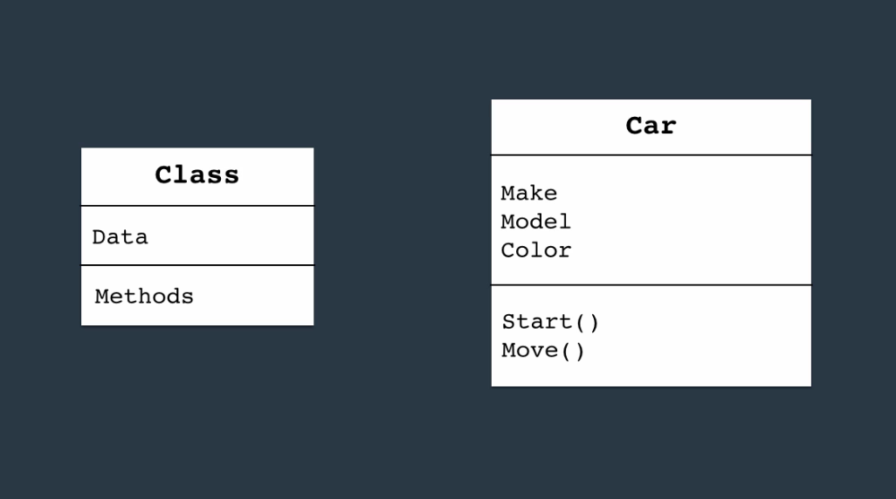
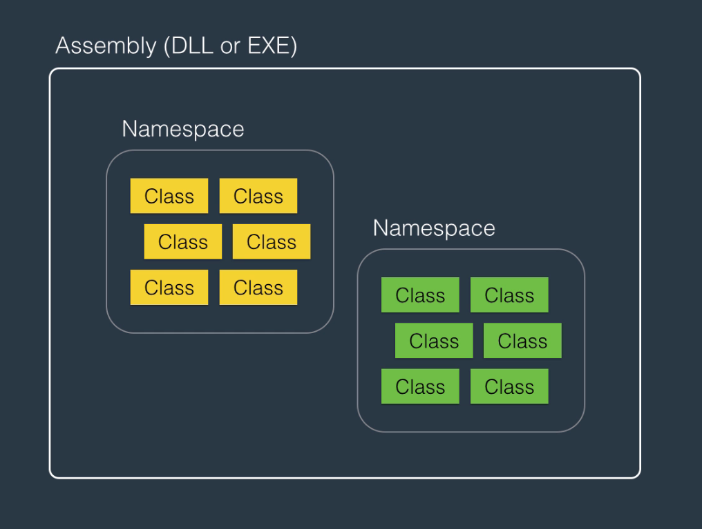

# Introduction to C# and .NET Framework

## C# vs .NET

- C# is a programming language
- .NET is a framework for building applications on Windows
- .NET applications can also be built in different languages like F# or VB.net
- .NET consists of 2 frameworks
  - CLR (Common Language RunTime)
  - Class Library for building applications

## CLR (Common Language Run-Time)

- Application that sits in the memory that translates Intermediate Language code to Native Code.
- C# has taken the idea from Java of having a compiled code. It takes user code and translates into Intermediate Language (IL) code.
- The advantage of this is you can run the same code on different machines/architectures.
- CLR is used to translate the IL Code into Machine Code and this process is called Just-In-Time Compilation (JIT)
  

- With this architecture, we can write an application in C# and we don't need to convert it for different machines. Any machine that supports CLR will be able to run C#

## Architecture of .NET Applications

- When we build an application in C#, we create building blocks called classes. These classes collaborate with each other at runtime to create an application that provides functionality
  
- Classes consist of
  - Data or Attributes
  - Methods or Functions.
    
- As classes grow, we need a way to organize these classes. We use a container called `namespace`.
- As namespaces grow, we need an application to maintain all of these. This is called Assembly. Can either be an executable (EXE) or Dynamically Linked Library (DLL)
- An assembly is a container for related namespaces.
  

## C# Application

- Click on `File > New Project > Console Application` for Visual C#
- A console application is an application that does not have a GUI
- Give a name to the project and specify it's location
- You can see the `Solution Explorer` panel by clicking on `View > Solution Explorer`
- `Program.cs` is where you write your code
- You can remove unused directives with ReSharper using `Alt + Enter`
- You can run your code using `Ctrl + F5`

## Questions

### Question 1

What is a namespace?

**Answer**
A container for classes

### Question 2

What is JIT Compliation?

**Answer**
The compilation of IL code to native machine code at runtime

### Question 3

What is an assembly?

**Answer**
A single unit of deployment of .NET applications
