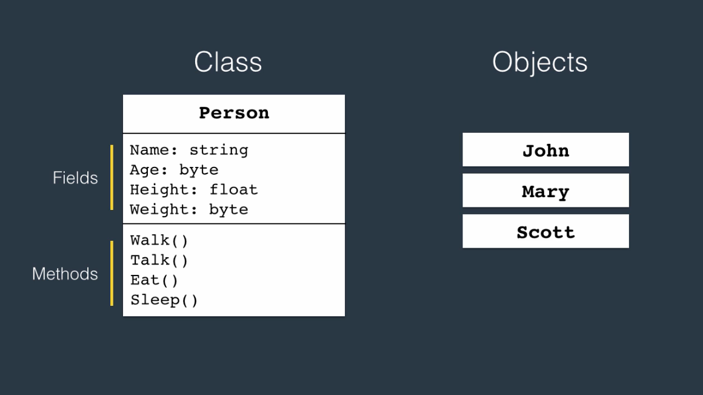
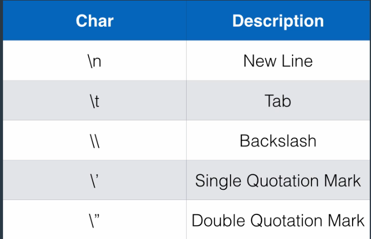
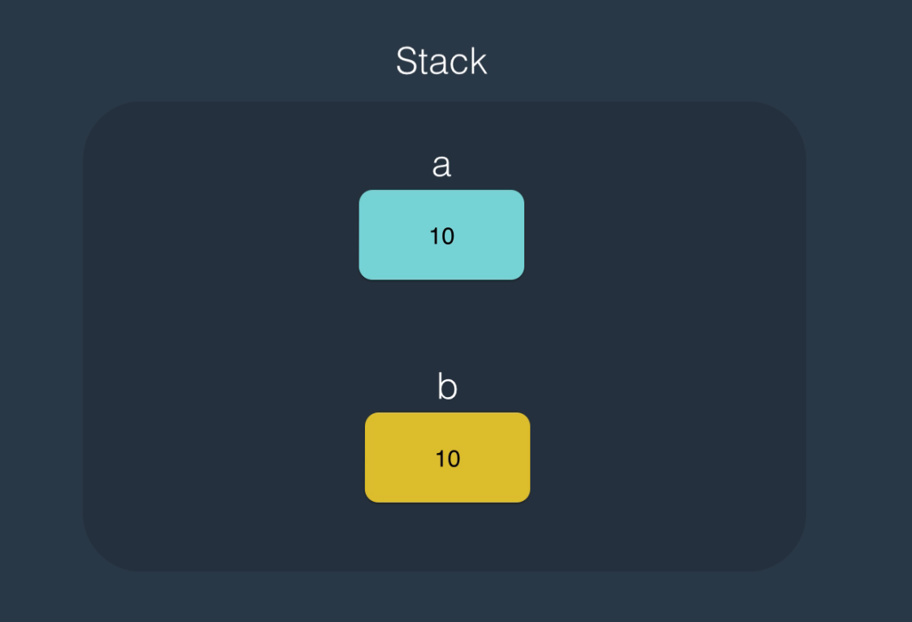
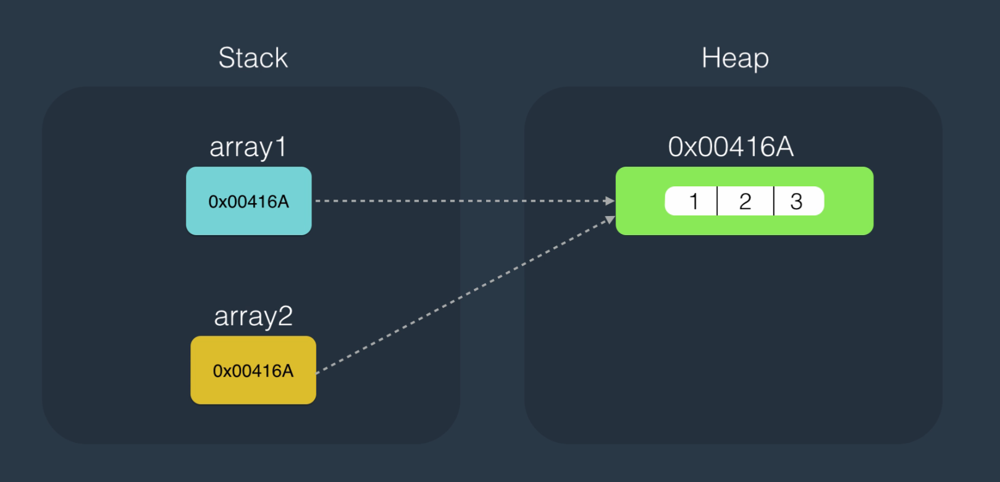

# Non-Primitive types

## Classes

- Building blocks of our application
- Combine related variables (fields) and functions (methods) together
- An object is an instance of the class
  

```csharp
public class Person // access_modifier class class_name
{
    public string Name; // Field Name
    public Person(string name)
    {
        Name = name;
    }
    public void Introduce() // access_modifier return_type method_name
    {
        Console.WriteLine($"Hello, {Name}");
    }
}
```

- To use an object, we must allocate memory to the object. We need to explicitly allocate memory
- C# handles garbage collections

```csharp
int number;
var person = new Person();
person.Name = "Jay";
person.Introduce();
```

- We can directly call the function by adding a `static` keyword to the function
- We use the static modifier when we want to show that only a single instance of that is present in the memory
- If you add `static` to either a field or a method, that object will be accessible from the class itself

```csharp
int result = Calculator.Add(1, 2);

public class Calculator
{
    public static int Add(int a, int b)
    {
        return a + b;
    }
}
```

- You can create a new class by going to `Solution Explorer`, right clicking on your repository/namespace, click `Add` and click on `Class`.

## Structure

- Similar to classes
- Use when you want to define a small light-weight object

## Arrays

- A data structure to store a collection of variables of the same type
- Array is an object behind the scene
- Arrays are 0 indexed.
- A class of namespace `System` represented as `System.Array`

### Declaring Arrays

- You can declare an array as follows

```csharp
int[] numbers = new int[3];

numbers[0] = 1;
numbers[1] = 2;
numbers[2] = 3;
```

- However, if you know the variables of the array ahead of time you can do as follows:

```csharp
int[] numbers = new int[3] {1, 2, 3};
```

- If you have provided a size but not values, the values are set to 0 by default.

## Strings

- A string is a sequence of characters surrounded by double quotes
- Most common way of creating a string is using a literal
- Strings are immutable. Once you create them you cannot change them
- A class of namespace `System` represented as `System.String`

```csharp
string firstName = "Mosh";
```

- We can concatenate strings using the `+` operator

```csharp
string name = firstName + " " + lastName;
```

### String Formatting

```csharp
string name = string.Format("{0} {1}", firstName, lastName);
```

### Create strings from List

- You can use the `Join` method to join the elements of a list into a string

```csharp
var numbers = new int[3] {1, 2, 3};
string list = string.Join(",", numbers);
```

### Accessing Elements

- Elements can be accessed by calling their index

```csharp
string name = "Mosh";
char firstChar = name[0]; //M
```

### Verbatim Strings

- There are a few escape characters:
  
- You can avoid having to use those `\` by using verbatim strings, that is, strings that start off with `@`

```csharp
string path = "c:\\projects\\project1\\folder1";
string seperatedLine = "Hello\nWorld";

// Can also be written as
string verbPath = @"c:\projects\project1\folder1";
string verSeperatedLine = @"Hello
World";
```

## ENUM

- Set datatype that represents name/value pairs (constants)
- If you have seperate methods/options.
- Use enums when you have multiple numbers of related constants
- Enum is an `integer` by default
- Enum is defined at the namespace level
- If no values are set to an Enum, the first name is going to be set to 0, and every other value will increment by 1

## Reference Types and Value Types

- We have two main types from which we can create new data types
- These two types are:

  1. Structures
     1. Primitive Types (take no more than 8 types)
     2. Custom Structures
  2. Classes
     1. Arrays
     2. Strings
     3. Custom Classes

- Structures are value types and classes are reference types

### Value Types

- Structures
- Allocated on stack
- Memory allocation done automatically
- Immediately removed by CLR when out of scope
- Example: `var anotherObject = someObject`
  

### Reference Types

- Classes
- You need to allocate memory using the `new` keyword
- Example: `Classname object = new Classname();`
- Memory allocated on heap. More sustainable
- If the object goes out of scope, it will remain in heap for some while
- Garbage collection by CLR
- The heap is stored on the stack
  

## Questions

### Question 1

What is the correct way to declare an int array?

**Answer**
int[] numbers = new int[3];

### Question 2

What would be the output of this code?

var array1 = new int[3] { 1, 2, 3 };

var array2 = array1;

array2[0] = 0;

Console.WriteLine(array1[0]);

**Answer**
0

### Question 3

How can we access the first element in this array?

var numbers = new int[3] { 1, 2, 3 };

**Answer**
numbers[0]

### Question 4

We have a class as follows:

```csharp
public class Point
{
public int X;
public int Y;
}
```

How can we create an object of type Point?

**Answer**
Point p = new Point();

### Question 5

We have a TaxCalculator class as follows. How can we call the Calculate method?

```csharp
public class TaxCalculator
{
public static float Calculate()
{
}
}
```

**Answer**
TaxCalculator.Calculate();

### Question 6

The \n escape character in a string represents:

**Answer**
A line-break

### Question 7

```csharp
What would be the result of this program?

var number1 = 1;

var number2 = number1;

number2++;

Console.WriteLine(number1);
```

**Answer**
1

### Question 8

We have an enum as follows:

```csharp
public enum CustomerType
{
Bronze,
Silver,
Gold
}
```

What will be the output of this code?

```csharp
var type = (int)CustomerType.Bronze;

Console.WriteLine(type):
```

**Answer**
0
