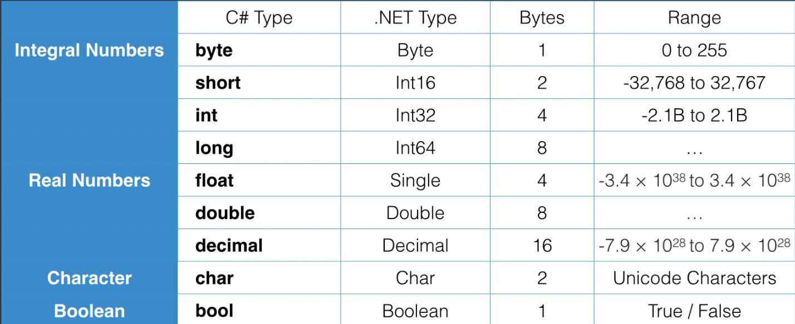
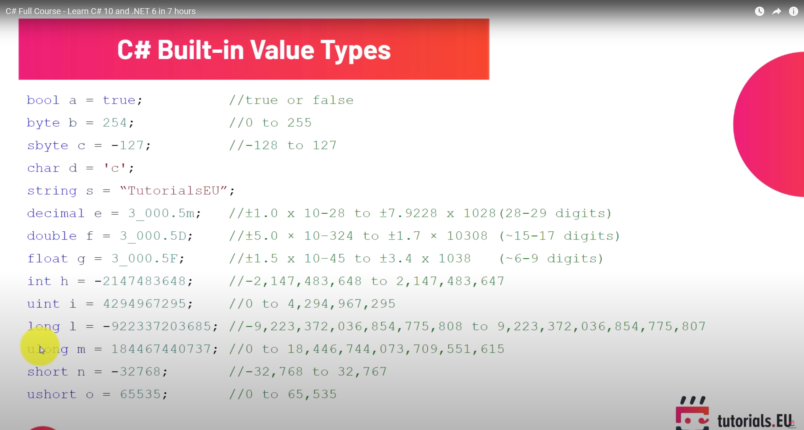
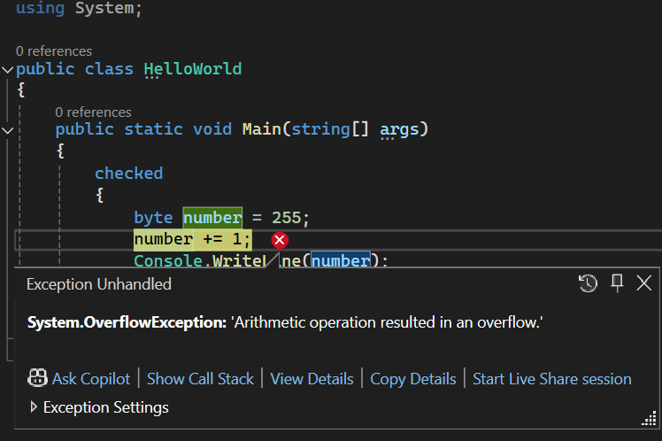

# Primitive Types and Expressions

## Variables and Constants

### Variable

- A name given to a storage location in memory

```Csharp
int number;
int Number = 1;
```

### Constant

- Immutable value. Declared using `const` followed by datatype followed by name.

- Note that you cannot define a constant without setting it's value

```csharp
const float Pi = 3.14f;
```

### Identifier

- Cannot start with number, have spaces, or be a reserved keyword

- <span style="color:red">1route</span>
- <span style="color:red">first name</span>
- <span style="color:red">int</span>

- <span style="color:green">oneRoute</span>
- <span style="color:green">firstName</span>
- <span style="color:green">@int</span>

- **Recommendation**: Always use readable names

### Naming Conventions

- Camel case: firstName: `int maxZoom;`
- Pascal Case: FirstName `int MaxZoom;`

### Primitive Types




- Note that for Real numbers, double is by default. To select float and decimal you would need to use `3.14f` and `5.16d`

### Non-Primitve Types

- String
- Array
- Enum
- Class

## C# doesn't have boundary checking. If you have a byte (of range 0-255) with value 255, and try adding one to it, it will result in the output as 0. This is called overflow

```csharp
using System;

public class HelloWorld
{
    public static void Main(string[] args)
    {
        byte number = 255;
        number += 1;
        Console.WriteLine(number);
    }
}
```

- You can prevent this overflow by adding `checked`. This will return an `OverflowException` instead
  

## Type Conversion

### Implicit Type Conversion

- When the compiler is 100% sure that there can be a type conversion, it does it implicitly
- A byte takes 1 byte of memory, an integer takes 4 bytes
- At runtime, when we convert from one form to another, the compiler just needs to add a bunch of 0s
- There is no data loss

#### Example

```csharp
byte b = 1;                            // 00000001
int i = b;  // 00000000 00000000 00000000 00000001
```

### Explicit Type Conversion (Casting)

- Let's say we are converting back into a byte.
- This time, there are chances of data loss so the runtime will not convert directly
- When the compiler knows there is a chance for data loss, it does not do implicit type conversion

```csharp
float f = 1.0f;
int i = (int)f;
```

### Conversion between non-compatible types

- We cannot convert a number represented by an integer as a string

```csharp
string s = "1";
int i = (int) s; //won't compile
```

- We use `Convert` class or `Parse` method

#### Convert

- Part of .NET network
- Defined in the system namespace
- Types:
  - ToByte()
  - ToInt16()
  - ToInt32()
  - ToInt64()
  - ToBoolean()

```csharp
string s = "1";
int i = Convert.ToInt32(s);
```

#### Parse

- All datatypes have the `Parse` Method
- Takes a string and converts into target

```csharp
string s= "1";
int i = int.Parse(s);
```

## Operators

### Arithmetic Operators

- Used when working with numbers
  - Addition (+)
  - Subtraction (-)
  - Multiplication (\*)
  - Division (/)
  - Remainder (%)
  - Increment (Postfix and Prefix) (++)
  - Decrement (Postfix and Prefix) (--)

### Comparison Operators

- Equal (==)
- Not Equal (!=)
- Greater than (>)
- Greater than or Equal to (>=)
- Less than (<)
- Less than or equal to (<=)

### Assignment Operators

- Assigment (=)
- Addition Assigment (+=)
- Subtraction Assignment (-=)
- Multiplication Assigment (\*=)
- Division Assignmetn (/=)

### Logical Operators

- And (&&)
- Or (||)
- Not (!)

### Bitwise Operators

- And (&)
- Or (|)

## Comments

- Keep the comments to a minimum. Code should be clean
- The comments should contain the why's, how's and not the what's. It should not explain what the code is doing

### Single Line Comment

```csharp
// Here is a single-line comment
int a = 1;
```

### Multi-Line Comments

```csharp
/*
Here is a multi-line comment
*/
int a = 1;
```

## Questions

### Question 1

What would be the value of number after this line is executed?

byte number = 1000;

**Answer**
This code cannot be compiled

### Question 2

The type long in C# is equivalent to which type in .NET framework?

**Answer**
Int64

### Question 3

What would be the output of this program?

byte number = 255;

number += 2;

Console.WriteLine(number);

**Answer**
Number will overflow and result will be 1

### Question 4

What would be the value of number2 after this code is executed?

int number1 = 257;

byte number2 = number1;

**Answer**
Since there is a chance for data loss during the conversion, compiler would stop the compilation

### Question 5

What would be the value z?

var x = true;

var y = false;

var z = true && false;

**Answer**
True && False = False

### Question 6

What would be the value of z?

var x = true;

var y = false;

var z = true || false;

**Answer**
True
