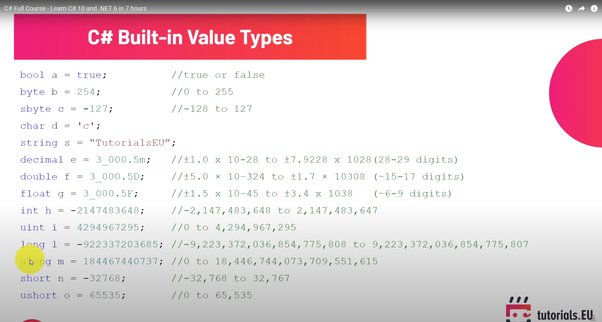

# Primitive Types and Expressions

## Variables and Constants

### Variable

- A name given to a storage location in memory

```Csharp
int number;
int Number = 1;
```

### Constant

- Immutable value. Declared using `const` followed by datatype followed by name.

- Note that you cannot define a constant without setting it's value

```csharp
const float Pi = 3.14f;
```

### Identifier

- Cannot start with number, have spaces, or be a reserved keyword

- <span style="color:red">1route</span>
- <span style="color:red">first name</span>
- <span style="color:red">int</span>

- <span style="color:green">oneRoute</span>
- <span style="color:green">firstName</span>
- <span style="color:green">@int</span>

- **Recommendation**: Always use readable names

### Naming Conventions

- Camel case: firstName: `int maxZoom;`
- Pascal Case: FirstName `int MaxZoom;`

### Primitive Types




- Note that for Real numbers, double is by default. To select float and decimal you would need to use `3.14f` and `5.16d`

### Non-Primitve Types

- String
- Array
- Enum
- Class

## C# doesn't have boundary checking. If you have a byte (of range 0-255) with value 255, and try adding one to it, it will result in the output as 0. This is called overflow

```csharp
using System;

public class HelloWorld
{
    public static void Main(string[] args)
    {
        byte number = 255;
        number += 1;
        Console.WriteLine(number);
    }
}
```

- You can prevent this overflow by adding `checked`. This will return an `OverflowException` instead
  
